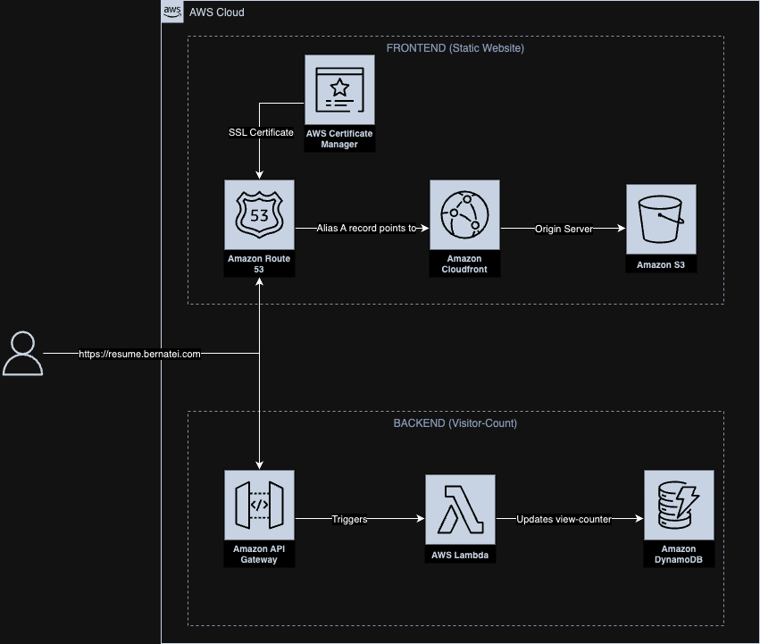

# Welcome to my Cloud Resume Challenge repository.
## Project Introduction:
This project is based in the [Cloud Resume Challenge AWS](https://cloudresumechallenge.dev/docs/the-challenge/aws/), created by [Forrest Brazeal](https://www.linkedin.com/in/forrestbrazeal). The premise of the challenge is to create a personal website using AWS Cloud with a Static Frontend (S3, Cloudfront, ACM, R53) and a Backend (API GW, Lambda, DynamoDB). The infrastructure must be created using IaC (Terraform) and CI/CD (Github Actions).

## Frontend
To complete this section, I created the following frontend resources:

1. An S3 bucket containing the static website files (index.html and script.js). I configured the bucket as the CloudFront origin and allowed only Distribution access via OAC.
2. A CloudFront distribution to act as the Content Delivery Network (CDN). CloudFront caches the origin files and serves requests with low latency due to its edge locations near users.
3. A Route 53 hosted zone where I purchased the domain and created two A (alias) records to route traffic from both the domain and subdomain to the CloudFront endpoint.
4. An ACM certificate to enable secure HTTPS connections.

## Backend
I created the following backend resources:

1. An API Gateway to receive and accept HTTP methods and trigger the Lambda function. The script.js file fetches the API endpoint.
2. A Python Lambda function that uses boto3 to connect to the DynamoDB table and execute the update_item expression. This expression updates the Quantity attribute of the View-Counter table.
3. A DynamoDB table called View-Counter with the primary key Stat and the attribute Quantity. This table stores the page view counter.

